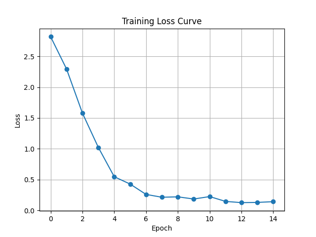

# 🧠 Minimal Transformer (PyTorch)

[](https://python.org)
[](https://pytorch.org)


This project implements a **minimal Transformer block** (attention + MLP) from scratch in PyTorch, trained on a toy copy task.  
It’s designed as an educational resource to understand Transformer internals step by step.

---

## 📂 Project Structure

```

Minimal\_Transformer/
│── components/
│   ├── attention.py           # Multi-head attention
│   ├── feedforward.py         # Position-wise feedforward network
│   ├── positional_encoding.py # Positional encodings
│   ├── transformer_block.py   # Encoder/decoder block
│   ├── encoder.py             # Encoder stack
│   ├── decoder.py             # Decoder stack
│   └── transformer.py         # Full Transformer model
│
│── data.py        # Toy dataset generator (copy task)
│── utils.py       # Helper functions (masking, etc.)
│── train.py       # Training script
│── test.py        # Testing script
│── requirements.txt
│── README.md

```

---

## 🚀 Training

Run training with:

```bash
python train.py
````

This will:

* Train a minimal Transformer on a toy **copy task**.
* Save model checkpoints to `model_checkpoints/`.
* Save a **training loss plot** (`training_loss.png`).

---

## 🔍 Testing

After training, run:

```bash
python test.py
```

This will:

* Load the trained checkpoint.
* Generate predictions on random toy inputs.
* Print input → output pairs.

Example output:

```
===== Testing Model on Random Input =====
Source: [4, 5, 6, 7, 8]
Prediction: [4, 5, 6, 7, 8]
```

---

## 📊 Results

A sample training curve:



---

## ⚡ Requirements

Install dependencies with:

```bash
pip install -r requirements.txt
```

---
